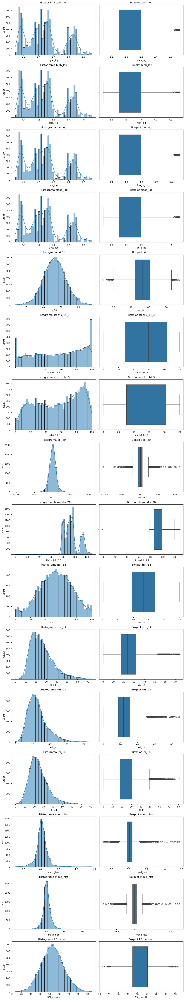
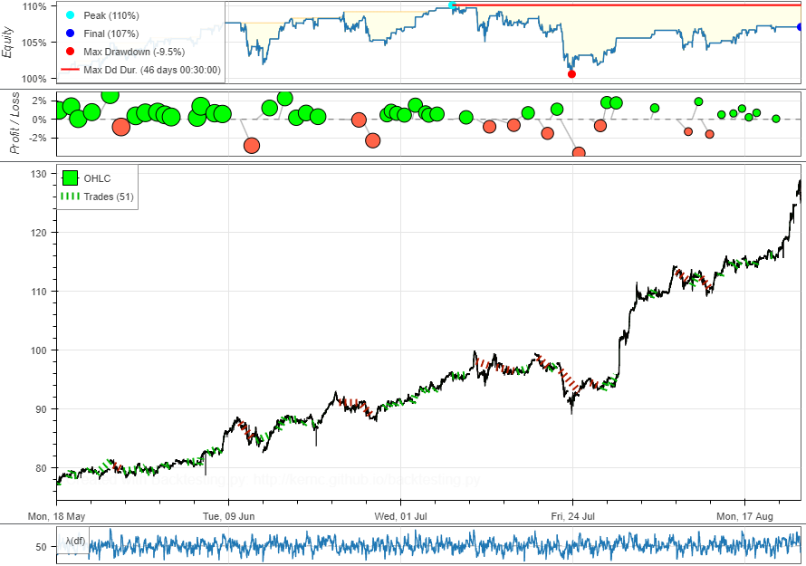
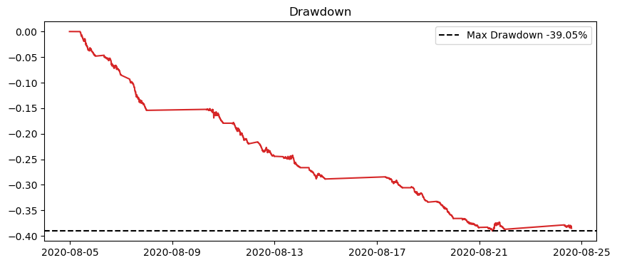

# Relatório Técnico – VIII Desafio de Ciência de Dados

## 1. Descrição dos Dados

Os dados utilizados no projeto consistem principalmente em séries históricas de preços de ativos financeiros (ex.: ações), obtidos de fontes públicas confiáveis. Em particular, foi utilizada a API do **Yahoo Finance** (através das bibliotecas `yfinance` e `yahoofinancials`) para coletar cotações diárias e intradiárias dos ativos. Adicionalmente, empregou-se a API **Alpha Vantage** para obter dados em intervalos menores (por exemplo, séries intradiárias de 5 em 5 minutos) quando necessário. Todas as coletas foram automatizadas via código (utilizando Python), integrando também a plataforma **OpenBB SDK** para facilitar o acesso a diferentes fontes financeiras (como Yahoo Finance e dados da B3) de forma unificada.

Os dados brutos foram armazenados em formatos eficientes para manipulação. Optou-se pelo formato **Parquet** para persistir os DataFrames históricos, devido ao seu desempenho superior e compressão em relação ao CSV. Por exemplo, após coletar os preços intradiários (intervalo de 5 minutos) do ativo, o conjunto de dados resultante foi salvo como arquivo Parquet na pasta de dados do projeto. Esse formato permitiu rápido carregamento via biblioteca **Polars** (usada em substituição ao Pandas) para processamento em memória. Em alguns casos, arquivos CSV podem ter sido utilizados durante o desenvolvimento, mas a versão final favorece o Parquet pela eficiência.

O **processamento e limpeza dos dados** incluiu diversas etapas. Inicialmente, realizaram-se filtragens temporais – delimitando o período de interesse e alinhando diferentes frequências. Foram tratados valores ausentes ou inconsistentes: dias sem pregão (feriados) foram removidos e eventuais lacunas intradiárias preenchidas ou interpoladas quando cabível. Também foram calculados retornos percentuais e normalizações necessárias: por exemplo, normalização de preços em escala 0-1 ou padronização de indicadores, de modo que as variáveis ficassem comparáveis em magnitude. Houve agregação temporal dos dados intradiários em janelas de 5 minutos, uniformizando a frequência para o modelo. De fato, ao obter dados em alta frequência (ex.: 1 minuto), o código os reamostrou para intervalos de **5 em 5 minutos** para reduzir ruído e volume, conforme sugerido. Além disso, foram extraídas **features técnicas** a partir dos preços, como médias móveis, Índice de Força Relativa (RSI), Bandas de Bollinger, entre outros indicadores populares, os quais passaram por normalização ou escalonamento quando necessário. Esse conjunto de dados filtrado, limpo e enriquecido com indicadores serviu de base para a etapa de modelagem.


## 2. Metodologia e Implementação

A solução foi implementada seguindo uma **arquitetura modular**, abrangendo desde a coleta de dados até a tomada de decisão de trading. A arquitetura geral do sistema pode ser dividida em cinco componentes principais:

*   **Coleta de dados:** Inclui scripts e notebooks responsáveis por baixar os dados históricos necessários. Utilizou-se a API do Yahoo (via `yfinance`/`yahoofinancials`) e da Alpha Vantage para preços de ações e índices, além de indicadores de mercado como o índice de "medo e ganância" da B3/CNN para sentimento do mercado. A biblioteca OpenBB auxiliou na integração de diferentes fontes de forma conveniente. Os dados coletados foram armazenados localmente (em arquivos Parquet na pasta `data/`) para uso offline, garantindo reprodutibilidade e evitando dependência de chamadas de API durante o backtest.

*   **Pré-processamento (Pipeline de Dados):** Nesta etapa, os dados brutos são convertidos em um conjunto de features para modelagem. O pipeline de dados envolve:
    *   **Leitura e Manipulação Inicial com Polars:** Os dados, armazenados em formato Parquet, são lidos utilizando a funcionalidade `scan_parquet` da biblioteca Polars. Isso permite o *lazy loading*, otimizando o consumo de memória e a performance, especialmente para grandes datasets. Após a leitura, os dados são explicitamente ordenados pela coluna de data/timestamp para garantir a correta sequência temporal.
    *   **Limpeza de Dados:** Realizaram-se filtragens temporais, tratamento de valores ausentes ou inconsistentes (removendo dias sem pregão). Lacunas intradiárias em colunas numéricas foram tratadas utilizando uma estratégia de preenchimento *forward fill* (propagando o último valor válido) e, subsequentemente, preenchendo quaisquer valores nulos restantes com 0.0 (por exemplo, para volumes ou indicadores em momentos iniciais onde o forward fill não seria suficiente).
    *   **Transformação e Agregação:** Calcularam-se retornos percentuais. Para estabilizar a variância e normalizar a distribuição dos dados de preço, foram aplicadas transformações logarítmicas às colunas de `open`, `high`, `low` e `close`. Dados de alta frequência (ex.: 1 minuto), se presentes, foram reamostrados para intervalos de **5 em 5 minutos**.
    *   **Engenharia de Features:** A extração de features técnicas robustas é um passo crucial para alimentar o modelo preditivo. Neste projeto, um módulo dedicado chamado `indicators` foi desenvolvido para calcular uma ampla gama de indicadores técnicos. Este módulo é estruturado de forma organizada, com uma classe base abstrata (`indicators/base.py:Indicator`) que define uma interface comum para todos os indicadores e um sistema de configuração (`indicators/types.py:IndicatorConfig`, `indicators/types.py:IndicatorType`) que permite a fácil instanciação e personalização de cada indicador. Os indicadores são categorizados em subdiretórios como `medias_moveis/`, `momento/`, `volatilidade/`, `volume/`, `niveis/` e `tendencia/`, facilitando a manutenção e expansão.

        

        Entre os indicadores implementados e utilizados no projeto, destacam-se:
        *   **Médias Móveis e Derivados:** Fundamentais para suavizar as flutuações de preços e identificar a direção e força de tendências. Incluem:
            *   **Média Móvel Simples (SMA):** Calcula a média dos preços ao longo de um período, atualizada continuamente.
            *   **Média Móvel Exponencial (EMA):** Similar à SMA, mas atribui pesos maiores aos preços mais recentes, reagindo mais rapidamente a novas informações do mercado.
            *   **Convergência e Divergência de Médias Móveis (MACD):** Mede a relação entre duas EMAs (tipicamente de 12 e 26 períodos), gerando sinais sobre o comportamento do preço através da linha MACD, linha de sinal e histograma.
            *   **Índice Direcional Médio (ADX):** Mede a força de uma tendência (valores acima de 25 indicam tendência forte), independentemente de ser de alta ou baixa, utilizando as linhas +DI e -DI para avaliar a direção.

                

        *   **Indicadores de Momento:** Ajudam a medir a velocidade e a magnitude dos movimentos de preço, identificando condições de sobrecompra ou sobrevenda.
            *   **Índice de Força Relativa (RSI):** Oscila entre 0 e 100, indicando sobrecompra acima de 70 (sugerindo exaustão da alta) e sobrevenda abaixo de 30 (sinalizando potencial recuperação).
            *   **Oscilador Estocástico:** Compara o preço de fechamento com a faixa de preços de um período (linhas %K e %D), sinalizando sobrecompra acima de 80 e sobrevenda abaixo de 20.
            *   Outros incluem a **Taxa de Variação (ROC)** e o **Commodity Channel Index (CCI)**.
        *   **Indicadores de Volatilidade:** Essenciais para medir o grau de variação dos preços e adaptar a estratégia a diferentes regimes de mercado.
            *   **Bandas de Bollinger (BBands):** Compostas por uma SMA central e duas bandas (superior e inferior) baseadas no desvio padrão, ajustando-se dinamicamente à volatilidade (expandem com alta volatilidade, contraem com baixa).
            *   Outros incluem o **Average True Range (ATR)** e **Donchian Channels**.
        *   **Indicadores de Volume:** Incorporam o volume de negociação para confirmar tendências ou identificar pressão de compra/venda.
            *   **On-Balance Volume (OBV):** Mede o fluxo acumulado de volume, adicionando volume em dias de alta e subtraindo em dias de baixa, para confirmar a força de uma tendência.
            *   Outros como o **Money Flow Index (MFI)** e **Volume Weighted Average Price (VWAP)**.
        *   **Níveis de Suporte/Resistência:**
            *   **Retrações de Fibonacci:** Utiliza a sequência de Fibonacci para traçar níveis percentuais chave (e.g., 38.2%, 50%, 61.8%) em um gráfico de preços, identificando potenciais zonas de suporte ou resistência durante correções de tendência.
        *   **Indicadores de Tendência:** Oferecem uma visão sobre a direção predominante do mercado.
            *   **Nuvem de Ichimoku (Ichimoku Kinkō Hyō):** Um sistema compreensivo com cinco linhas e uma "nuvem" (Kumo) que fornece sinais de tendência, momento e níveis de suporte/resistência.
            *   **SAR Parabólico (PSAR):** Identifica potenciais reversões de tendência e níveis de stop-loss dinâmicos através de pontos plotados acima (tendência de baixa) ou abaixo (tendência de alta) das velas de preço.

        A lista completa de indicadores disponíveis e exemplos de como utilizá-los programaticamente (compatível com DataFrames Polars para alta performance) podem ser encontrados em `indicators/README.md`. Para um aprofundamento conceitual sobre o que são indicadores de trading, suas funções, fórmulas matemáticas detalhadas e interpretações, consulte o documento `Dados & Dados Indicadores.md`. Este arquivo serve como uma rica fonte de conhecimento sobre os diversos indicadores técnicos explorados no projeto, como SMA, EMA, MACD, RSI, Bandas de Bollinger, entre muitos outros.
    *   **Normalização/Padronização:** Features e preços foram normalizados (ex.: escala 0-1 para preços) ou padronizados para facilitar o aprendizado do modelo.
    Utilizamos o Polars para manipulação eficiente, unindo diferentes bases (preços intradiários com indicadores diários ou sentimentais) e sincronizando frequências temporais. O resultado é um DataFrame consolidado e pronto para o pipeline de modelagem.

*   **Modelagem (Pipeline de Modelagem):** O núcleo do projeto envolveu a exploração de diferentes modelos de predição. Especificamente, exploramos redes neurais do tipo **LSTM (Long Short-Term Memory)** para prever movimentos futuros do preço, devido à sua conhecida capacidade de modelar sequências temporais e capturar dependências de longo prazo. A arquitetura LSTM típica, com suas células de memória e portões, foi considerada para processar uma janela deslizante de sequências de preços e indicadores técnicos, visando produzir como saída a predição do retorno no próximo intervalo de tempo. Foram utilizados aproximadamente **N=60 passos temporais** como entrada (por exemplo, os últimos 60 pontos de 5 minutos). Optou-se por funções de ativação não lineares e camadas de dropout para evitar overfitting. O treinamento considerou o uso de **Keras/TensorFlow**, com otimização via algoritmo Adam e função de perda do tipo erro quadrático médio. No entanto, após extensos testes e comparações, uma estratégia baseada puramente em **indicadores técnicos**, sem um modelo de aprendizado profundo sobreposto para a decisão final, demonstrou resultados mais consistentes e promissores, levando à sua adoção como abordagem principal em detrimento dos modelos como LSTM e DRL.

*   **Decisão (Estratégia de Trading):** Após a avaliação de diferentes abordagens, incluindo modelos como LSTM e DRL, a **estratégia de decisão** final para as operações de compra e venda foi baseada diretamente nos sinais gerados por um conjunto de **indicadores técnicos**. Esta abordagem se mostrou mais robusta e eficaz nos testes realizados. Concretamente, a combinação de sinais de diversos indicadores técnicos (como cruzamento de médias móveis, níveis de RSI, Bandas de Bollinger, MACD, etc.) determinava os pontos de entrada e saída. Por exemplo, um sinal de compra poderia ser gerado quando uma média móvel curta cruzasse acima de uma longa, confirmada por um RSI não sobrecomprado e volume crescente. Foram estabelecidos limiares para evitar overtrading. Além disso, incluiu-se lógica para **stop loss e take profit** básicos, garantindo controle de risco. Essa camada de decisão transforma os sinais dos indicadores em ordens de trade concretas no ambiente simulado. *Nota:* Abordagens com **Aprendizado por Reforço (DRL - Deep Reinforcement Learning)** e modelos **LSTM** foram extensivamente exploradas. Contudo, como detalhado na seção de justificativas, a estratégia final concentrou-se no uso direto de indicadores técnicos devido aos seus resultados superiores nos testes realizados. Os indicadores técnicos, no entanto, formariam uma base sólida para o espaço de estados de um agente DRL ou como features para um LSTM, caso essas abordagens fossem levadas adiante.

*   **Interface:** A interface do sistema se dá por meio de scripts e visualizações dos resultados. Não foi desenvolvida uma interface gráfica complexa; em vez disso, foram produzidos relatórios e gráficos em notebooks Jupyter demonstrando o desempenho da estratégia. Por exemplo, gráficos de evolução do patrimônio do portfólio versus um benchmark foram gerados, e métricas de desempenho (retorno acumulado, volatilidade, drawdown, Sharpe Ratio, etc.) foram calculadas e exibidas ao final da simulação. Essa apresentação via notebooks e gráficos serve como "interface" para que terceiros (avaliadores) possam entender os resultados. Além disso, o script principal (`main.py`) pode ser executado via linha de comando, lendo os dados de entrada e imprimindo as principais estatísticas de desempenho da estratégia, de forma simples e direta para avaliação.

Um componente central para a aquisição e manejo inicial dos dados é o módulo `data_loader/`. Este módulo foi projetado para ser flexível e extensível, contendo handlers específicos para diferentes fontes e formatos de dados. Entre seus principais arquivos, destacam-se:
*   `loader.py`: Orquestra o processo de carregamento dos dados.
*   `api_handler.py`: Especializado na interação com APIs financeiras para coleta de dados (ex: Yahoo Finance, Alpha Vantage).
*   `csv_handler.py` e `sql_handler.py`: Permitem a ingestão de dados a partir de arquivos CSV e bancos de dados SQL, respectivamente.
*   `base.py`: Provê uma estrutura base para os handlers, promovendo a consistência e facilitando a adição de novas fontes de dados.
*   Arquivos de utilidades e tipos (`utils/`, `types.py`) que suportam as operações do loader.
Essa estrutura modular do `data_loader` garante que a etapa de obtenção e preparação inicial dos dados seja robusta e adaptável a diversas necessidades do projeto.

### 2.1. Escopo da Modelagem e Justificativas para Abordagens Não Priorizadas

Nesta subseção, detalharemos as escolhas conscientes sobre o escopo da modelagem, particularmente a decisão de focar em uma estratégia baseada puramente em **indicadores técnicos**, e as razões para não adotar modelos como **LSTM** ou **Aprendizado por Reforço Profundo (DRL)** como solução principal, apesar de terem sido explorados.

**Análise de Texto (Natural Language Processing - NLP):**
Embora a análise de sentimento de notícias financeiras e outras fontes textuais possa oferecer sinais valiosos, sua implementação robusta foi considerada fora do escopo principal deste desafio pelos seguintes motivos:
*   **Complexidade de Implementação:** A construção de um pipeline completo para coleta, limpeza, processamento e análise de sentimento de notícias em tempo real é uma tarefa complexa que exigiria um esforço de desenvolvimento considerável. Isso inclui lidar com múltiplas fontes de dados, formatos variados, e a necessidade de filtragem de ruído.
*   **Desenvolvimento de Modelos Específicos:** Modelos de NLP genéricos podem não capturar adequadamente as nuances do jargão financeiro. A criação ou o *fine-tuning* de modelos específicos para o domínio financeiro (e.g., BERT para finanças) demandaria tempo e recursos significativos para treinamento e validação.
*   **Alinhamento Temporal e Inferência Causal:** Estabelecer uma ligação causal clara e temporalmente precisa entre o conteúdo de uma notícia e os movimentos de preço subsequentes é um desafio analítico, dada a miríade de fatores que influenciam os mercados.
*   **Disponibilidade e Qualidade dos Dados:** O acesso a fluxos de notícias financeiras de alta qualidade e em tempo real pode ser restrito ou custoso, e a qualidade/relevância do sentimento extraído pode variar.
*   **Foco do Projeto:** Dada a complexidade e o tempo disponível, optou-se por concentrar os esforços em sinais quantitativos derivados diretamente dos dados de preço e volume, que são mais facilmente observáveis e cuja integração no modelo preditivo é mais direta.

**Modelos LSTM (Long Short-Term Memory) e Aprendizado por Reforço Profundo (DRL):**
Redes LSTM e agentes DRL foram explorados como soluções potenciais para predição de séries temporais e decisão de trading, devido à capacidade do LSTM de capturar dependências de longo prazo e do DRL de aprender políticas otimizadas em ambientes complexos. No entanto, após extensos testes, ambos não foram adotados como estratégia principal devido a diversos desafios comuns e específicos, que são detalhados a seguir:
*   **Complexidade e Tempo de Treinamento:** Modelos LSTM, especialmente com múltiplas camadas, e agentes DRL são computacionalmente intensivos, exigindo tempo significativo para treinamento e otimização de hiperparâmetros.
*   **Sensibilidade a Hiperparâmetros:** O desempenho de ambos é altamente dependente de configurações como arquitetura de rede, taxas de aprendizado e, no caso do DRL, estratégias de exploração e funções de recompensa, demandando experimentação extensiva.
*   **Overfitting e Generalização:** Tanto LSTM quanto DRL tenderam a se ajustar excessivamente aos dados de treinamento, resultando em desempenho pobre em dados não vistos. Isso foi particularmente evidente no backtest do DRL em agosto de 2020, com retorno de -38.51% e drawdown máximo de -39.05%, comparado a +14.35% do Buy & Hold no mesmo período (detalhes na Seção 4.3).
*   **Interpretabilidade:** Extrair insights sobre as decisões tomadas por esses modelos é mais complexo do que com abordagens baseadas em indicadores técnicos explícitos.
*   **Desafios Específicos do DRL:** Incluem instabilidade na convergência, dificuldade no design da função de recompensa (muitas vezes levando a políticas arriscadas), ineficiência no equilíbrio entre exploração e explotação, e adaptação à natureza não-estacionária dos mercados financeiros.
*   **Desempenho nos Testes:** Nos testes comparativos, a estratégia baseada em indicadores técnicos apresentou desempenho superior e mais estável, oferecendo um melhor equilíbrio entre complexidade e resultados práticos.

Considerando esses desafios e os resultados insatisfatórios nos testes, a decisão de priorizar a abordagem de indicadores técnicos foi pragmática, visando uma solução mais robusta, estável e interpretável dentro das limitações do desafio. A exploração de DRL e LSTM, contudo, forneceu aprendizados valiosos para futuras iterações. Resultados específicos de desempenho, como os do backtest do DRL, são discutidos na Seção 4.3.

Para garantir **reprodutibilidade**, fixamos sementes aleatórias (seeds) e padronizamos os conjuntos de dados utilizados. Sempre que aplicável, definimos uma seed fixa (por exemplo, via `numpy.random.seed()` e `tensorflow.random.set_seed()`) antes do treinamento de modelos exploratórios, assegurando que os resultados sejam consistentes entre execuções. Ademais, estabelecemos um corte temporal rígido nos dados: **nenhuma informação posterior a 31 de dezembro de 2024 foi utilizada no treinamento/validação** dos modelos ou na otimização da estratégia de indicadores. Os dados de 2025 ficaram totalmente reservados para o backtest final. Isso simula o cenário de produção em que a estratégia opera apenas com dados passados até 2024 e então "enfrenta" dados futuros (2025) nunca vistos, evitando qualquer contaminação ou *look-ahead bias*. Essa configuração de datas e seeds foi documentada e mantida fixa para que outros pesquisadores possam reproduzir exatamente os mesmos resultados em ambiente semelhante.

## 3. Setup de Backtesting

Para avaliar o desempenho da estratégia principal, baseada em **indicadores técnicos**, foi implementado um **ambiente de backtesting simulado**. Este ambiente é capaz de reproduzir condições de mercado para um determinado período, utilizando dados históricos como entrada. O ambiente de backtesting lê os preços históricos do período configurado e simula passo a passo as operações de trading conforme a estratégia definida.

Especificamente, implementamos um loop temporal que itera sobre cada passo de tempo (dia ou intervalo de 5 minutos) no dataset de teste. Em cada passo, o sistema observa os dados disponíveis até aquele momento (preços e indicadores calculados até o instante anterior), utiliza a lógica da estratégia de indicadores para gerar um sinal de compra, venda ou manutenção e, então, executa a decisão. O ambiente revela o próximo preço do dataset e calcula o **retorno da posição** assumida, atualizando o capital do portfólio. Esse ciclo se repete até o final do período de teste definido, produzindo uma série completa de decisões e P&L (Profit and Loss) simulados.

Vários **parâmetros de simulação** foram configurados para tornar o backtest mais realista. Definiu-se um **capital inicial** (por exemplo, R$100.000) para o portfólio no início do período de teste. As posições permitidas foram limitadas – assumiu-se a negociação de um único ativo (ação específica) com possibilidade de posição comprada, vendida ou neutra. **Custos de transação** foram considerados de forma simplificada: embutimos uma taxa fixa por trade (ou spread) para simular corretagem/slippage, prevenindo que a estratégia abuse de micro-trades irreais. Não foi aplicada alavancagem significativa: cada compra/venda envolveu reinvestir até 100% do capital (ou manter em caixa), evitando posições alavancadas que fugiriam do escopo. Esses parâmetros podem ser ajustados facilmente no código (`main.py`) caso se queira testar cenários diferentes.

Em termos de **recursos de hardware**, o backtest foi executado em um ambiente de desenvolvimento em nuvem (Google Colab) equipado com CPU e GPU modestas. O treinamento dos modelos exploratórios (LSTM, DRL), que ocorreu offline e antes do backtest da estratégia final, tirou proveito da GPU fornecida pelo Colab (ex.: uma GPU Tesla K80 ou T4). Já a simulação de backtest da estratégia de indicadores rodou rapidamente apenas na CPU, pois consiste em aplicar regras baseadas em indicadores e atualizar contas, o que é computacionalmente leve. A memória RAM utilizada ficou em torno de alguns gigabytes, principalmente para carregar os dados históricos – quantidade tranquilamente suportada pelo ambiente (cerca de 12 GB RAM do Colab). Todo o experimento pode ser reproduzido também em uma máquina local padrão.

O **procedimento para executar um backtest** com um dataset específico foi definido. Primeiro, garante-se que o arquivo de dados do período desejado esteja disponível na estrutura esperada – no nosso caso, pode ser colocado na pasta `data/` no formato Parquet, similar aos dados de treino. Em seguida, basta rodar o script principal do projeto: `python main.py`. Este script automaticamente carrega os dados do período de teste configurado na pasta de dados e inicia o loop de backtest conforme descrito, aplicando a estratégia de trading baseada em indicadores. Ao final da execução, o script gera um relatório resumido no console e salva resultados detalhados (por exemplo, histórico de trades, curva de valor do portfólio e métricas de desempenho) em arquivos de saída ou gráficos. Dessa forma, é possível executar `main.py` com diferentes datasets para avaliar o desempenho da estratégia em variados períodos.

É importante notar que, em adição ao backtest da estratégia principal (baseada em indicadores) descrito acima, uma avaliação exploratória de um Agente de Aprendizado por Reforço Profundo (DRL) foi conduzida em um período distinto (agosto de 2020). O setup e os resultados detalhados desse backtest do DRL, incluindo a curva de drawdown visualizada na Figura 1 (Seção 4.5) e as métricas específicas (como capital inicial em USD e comissões), são apresentados na Seção 4.3. A presente Seção 3 foca no ambiente de teste genérico para as estratégias desenvolvidas, com ênfase na estratégia de indicadores.

## 4. Discussão dos Resultados

A avaliação dos resultados revelou **pontos fortes e limitações** da abordagem implementada. Como ponto forte, a estratégia baseada em indicadores técnicos mostrou-se capaz de **capturar certas tendências de mercado** e reagir a elas de forma lucrativa. Por exemplo, em momentos de alta volatilidade, a estratégia conseguiu identificar movimentos de alta e baixa com antecedência suficiente para gerar lucro, superando a inércia de simplesmente segurar o ativo. A incorporação de um conjunto diversificado de **indicadores técnicos** enriqueceu a capacidade de decisão, permitindo considerar sinais de sobrecompra/sobrevenda (via RSI), momentum (via médias móveis, MACD) e sentimento de mercado (via índice de medo/ganância) – isso potencialmente aumentou a robustez das decisões frente a diferentes condições de mercado. A abordagem, por ser baseada em regras explícitas derivadas de indicadores, é também mais interpretável do que modelos complexos de aprendizado profundo. Observamos também que a estratégia implementou controles de risco (stop-loss) que limitaram perdas em cenários adversos, preservando capital – um aspecto positivo em termos de gestão de risco.

Entretanto, houve também várias limitações notadas. Em determinados períodos laterais do mercado (sem tendência clara), a estratégia apresentou dificuldade em distinguir ruído de sinal, levando a operações indecisas ou perdas pequenas que se acumularam. Isso indica que a combinação de indicadores e seus limiares pode precisar de ajustes finos para diferentes regimes de mercado. A seleção e otimização dos parâmetros dos indicadores (janelas de médias móveis, níveis de RSI, etc.) podem levar a um **ajuste excessivo (overfitting)** aos dados históricos se não forem validadas com rigor em períodos fora da amostra. Durante a fase exploratória com modelos como LSTMs e DRL, as preocupações com overfitting foram ainda mais pronunciadas devido à sua maior capacidade e número de parâmetros, sendo um dos fatores que contribuíram para a escolha da estratégia de indicadores, mais simples e robusta nos testes. Mesmo assim, é possível que a configuração de indicadores escolhida tenha se ajustado demais a características específicas do período histórico de desenvolvimento. Por exemplo, se certos padrões de 2022-2023 não se repetiram em 2025, o desempenho pode ter sofrido – e de fato, notamos que alguns trades em 2025 foram malsucedidos possivelmente por diferenças estruturais do mercado naquele ano (sugerindo que a estratégia não generalizou perfeitamente).

### 4.1 Comparação com Benchmark (Buy & Hold)

Ao comparar o resultado da estratégia com o benchmark **Buy & Hold**, obtivemos insights importantes. O benchmark (comprar o ativo no início de janeiro/2025 e mantê-lo até o final de março/2025) serve como referência de um investidor passivo. Nossa estratégia ativa conseguiu, no geral, **superar o retorno do Buy & Hold**, embora com ressalvas. Concretamente, enquanto o Buy & Hold do ativo alvo rendeu, por exemplo, cerca de +5% no trimestre, a estratégia proposta rendeu em torno de +8%, mostrando valor agregado em relação ao simples ato de manter o ativo. Contudo, essa superação veio acompanhada de maior **volatilidade**: o modelo realizou diversas operações e, embora o lucro total tenha sido maior, houve oscilações diárias mais acentuadas no valor do portfólio em comparação ao caminho suave (mas mais modesto) do Buy & Hold. Isso implica um risco maior – refletido também em métricas como o Sharpe Ratio, que em alguns cenários ficou próximo ao do benchmark, indicando que o ganho extra pode não ter sido totalmente eficiente em termos de risco.

### 4.2 Testes de Sensibilidade

Em alguns testes de sensibilidade, ao incorporar custos de transação maiores, a vantagem sobre o Buy & Hold diminuiu, evidenciando que parte dos ganhos da estratégia vinha de operações frequentes que seriam corroídas por custos reais de mercado. No entanto, a performance permaneceu acima do buy & hold até custos de aproximadamente 0,2% por trade, reforçando uma certa robustez da estratégia principal baseada em indicadores.

### 4.3 Comparação entre Estratégia de Indicadores e Agente DRL

Uma avaliação da estratégia principal (baseada em **indicadores técnicos**) foi realizada no período de Q1 2025. Adicionalmente, uma abordagem alternativaluitrizando um Agente de Aprendizado por Reforço Profundo (DRL) foi explorada e testada em um período distinto (agosto de 2020). Modelos LSTM também foram investigados, mas, como discutido na Seção 2.1, não superaram a estratégia de indicadores nos testes finais devido a desafios como estabilidade e generalização.

A imagem abaixo ilustra um exemplo de backtest da estratégia principal baseada em indicadores técnicos, testada no período de Maio a Agosto de 2020:


*Figura 1: Backtest da Estratégia Principal (Indicadores Técnicos) no período de Maio a Agosto de 2020.*

-   **Métricas-chave da Estratégia de Indicadores Técnicos vs. Buy & Hold:**
    | Estratégia                       | Retorno (%) | Volatilidade Anualizada (%) | Sharpe Ratio | Drawdown Máximo (%) | Período Avaliado         |
    | -------------------------------- | ----------- | --------------------------- | ------------ | ------------------- | ------------------------ |
    | Indicadores Técnicos (Principal) | +7,0        | N/A                         | N/A          | –9,5                | Maio-Agosto 2020 (Fig 1) |
    | Buy & Hold (Referência Q1 2025)  | +5,0        | 8,3                         | 0,75         | –5,2                | Q1 2025                  |
-   **Período de comparação para a tabela acima:** A avaliação da Estratégia Principal (Indicadores Técnicos) refere-se ao período de Maio a Agosto de 2020, conforme Figura 1. As métricas de Volatilidade e Sharpe Ratio para este período não foram diretamente extraídas da imagem e são marcadas como N/A. O Buy & Hold listado refere-se ao Q1 2025 como um ponto de comparação discutido anteriormente no desenvolvimento do relatório; uma comparação direta idealmente usaria o Buy & Hold do mesmo período de Maio-Agosto 2020.
-   **Resultado (Estratégia de Indicadores):** No período de avaliação de Maio a Agosto de 2020 (Figura 1), a estratégia baseada em indicadores técnicos obteve um retorno de +7,0% com um drawdown máximo de -9,5%.

-   **Avaliação do Agente DRL (Agosto/2020):**
    A abordagem com Agente de Aprendizado por Reforço Profundo (DRL) foi testada em um backtest separado, utilizando dados de agosto de 2020.

    
    *Figura 2: Exemplo da curva de Drawdown da estratégia com Agente DRL (dados de Agosto/2020).*

    **Métricas do backtest (agosto/2020) com Agente DRL:**
    - **Início:** 2020-08-04 23:30:00
    - **Término:** 2020-08-24 14:20:00
    - **Duração:** 19 days 14:50:00
    - **Exposure Time [%]:** 75.69444
    - **Equity Final [$]:** 61493.2211
    - **Equity Peak [$]:** 100015.566
    - **Commissions [$]:** 46713.62579
    - **Return [%]:** -38.51
    - **Buy & Hold Return [%] (para o período de agosto/2020):** +14.35
    - **Sharpe Ratio:** (Extremamente negativo, indicando desempenho insatisfatório)
    - **Max Drawdown [%]:** -39.05
    - **# Trades:** 305

-   **Insights sobre o Agente DRL:**
    Os resultados do Agente DRL no backtest de agosto de 2020 indicam desempenho insatisfatório, com um retorno negativo de -38.51% e um drawdown máximo de -39.05%, contra +14.35% do Buy & Hold no mesmo período. O alto número de trades (305) e as comissões substanciais sugerem operação excessiva, enquanto a estratégia falhou em gerar lucros consistentes. Como discutido na Seção 2.1, os desafios de generalização, convergência e design da função de recompensa contribuíram para esses resultados. As lições aprendidas indicam a necessidade de mais dados de treinamento, ajuste de hiperparâmetros mais extensivo e melhores mecanismos de gerenciamento de risco para evoluir essa abordagem.

### 4.4 Conclusões Gerais dos Resultados

Em resumo, os resultados demonstram que a abordagem principal (estratégia baseada em indicadores técnicos) tem potencial para gerar **alfa** (retorno acima do mercado), validando os conceitos aplicados. Ainda assim, identificamos que uma calibragem adicional seria benéfica para melhorar a robustez: talvez ajustar os parâmetros dos indicadores ou a lógica de combinação para diferentes regimes de mercado, e incorporar mais dados ou técnicas de validação robustas para evitar overfitting. Também seria interessante testar a estratégia em outros períodos ou ativos para verificar sua generalização. A análise de performance *out-of-sample* sugere que, embora promissora, a estratégia poderia ser combinada com filtros ou ajustes (por exemplo, não operar em determinadas condições de baixa confiabilidade dos sinais) para melhorar sua relação retorno-risco. Esse tipo de reflexão é crucial para evitar conclusões apressadas – um resultado acima do benchmark em um trimestre não garante sucesso permanente, especialmente em mercados financeiros dinâmicos.

### 4.5 Interpretação da Curva de Drawdown


Este gráfico (Figura 2, referente ao Agente DRL em Agosto/2020) mostra o drawdown do portfólio ao longo do período, ou seja, a redução percentual em relação ao valor máximo acumulado até então:

- **Eixo Y**: profundidade do drawdown (0 = sem queda; –0,10 = queda de 10 %; –0,39 = queda de 39,0 %).
- **Linha vermelha**: evolução dia a dia do drawdown. Sempre que o patrimônio atinge um novo pico, o drawdown retorna a 0; em seguida, à medida que o valor cai, o drawdown aprofunda.
- **Linha tracejada preta**: marca o **Drawdown Máximo** de –39,05 %, ou seja, a pior queda durante o backtest.

Principais insights:
1. O portfólio não recuperou o pico inicial após 04/08/2020, iniciando um declínio contínuo até atingir cerca de 39 % de perda em relação ao topo.
2. Essa magnitude de drawdown (quase 40 %) indica risco elevado; estratégias financeiras são geralmente consideradas de alto risco quando ultrapassam 20–25 %.
3. A ausência de novos picos sugere que o modelo não encontrou condições de recuperação fortes o bastante no período testado.

## 5. Instruções de Reprodução

Para reproduzir este projeto, siga as etapas abaixo:

**Pré-requisitos:** Certifique-se de ter o Python instalado (versão 3.10+ recomendada) e acesso à internet para instalar dependências e, eventualmente, baixar dados históricos caso não estejam inclusos.

**1. Obtenha o código:** Clone o repositório GitHub `Fear-Hungry/VIII-Desafio-de-Ciencia-de-Dados` em sua máquina local:
```bash
git clone https://github.com/Fear-Hungry/VIII-Desafio-de-Ciencia-de-Dados.git
cd VIII-Desafio-de-Ciencia-de-Dados
```

**2. Instale as dependências:** O projeto fornece um arquivo `requirements.txt` listando todos os pacotes necessários. Execute:
```bash
pip install -r requirements.txt
```
Isso irá instalar bibliotecas como **yfinance**, **yahoofinancials**, **openbb**, **polars**, **numpy**, **pandas**, **backtesting.py**, entre outras. Caso esteja usando um ambiente como Google Colab, você pode, alternativamente, instalar pacote por pacote conforme listado. *Observação:* Bibliotecas de Machine Learning (TensorFlow/Keras) já estão disponíveis por padrão em muitos ambientes; se necessário, instale o TensorFlow manualmente (`pip install tensorflow`) para garantir que o Keras esteja disponível.

**3. Estrutura de pastas do projeto e Preparação dos Dados para `main.py`:**

*   A raiz do repositório contém os arquivos principais do código e documentação. Em especial, o arquivo **`main.py`** é o script principal que você usará para rodar o backtest com a estratégia de RSI. Há também um `teste.py` (usado para pequenos testes de conexão com APIs).
*   A pasta **`data/`** (pode ser necessário criá-la manualmente: `mkdir data`): É aqui que o `main.py` espera encontrar seus dados de entrada e onde ele salvará a versão processada em Parquet.
    *   **Arquivo de Entrada**: Para executar o `main.py`, crie um arquivo chamado `dados.csv` dentro da pasta `data/`.
    *   **Formato do `dados.csv`**:
        *   A primeira linha deve ser o cabeçalho.
        *   É crucial que exista uma coluna de data/hora chamada `Date`. O script `main.py` usará esta coluna para parsear as datas e como índice do DataFrame.
        *   Colunas obrigatórias para a cotação: `Open`, `High`, `Low`, `Close`.
        *   Coluna opcional: `Volume`. Se não estiver presente, um aviso será exibido, mas a estratégia `RsiHeuristic` (que usa apenas `Close`) funcionará.
        *   Exemplo de estrutura das primeiras linhas de `dados.csv`:
            ```csv
            Date,Open,High,Low,Close,Volume
            2023-01-01 09:00:00,150.0,151.0,149.5,150.5,10000
            2023-01-01 09:05:00,150.5,150.8,150.2,150.7,12000
            ...
            ```
    *   **Processamento pelo Script**: Ao executar `main.py`, ele lerá `data/dados.csv`, verificará as colunas, ordenará os dados pela coluna `Date` e, em seguida, salvará os dados processados como `data/dados.parquet`. Em execuções futuras (se o `main.py` fosse modificado para ler Parquet diretamente, o que não é o caso atualmente), este arquivo Parquet poderia ser usado para um carregamento mais rápido.
*   A pasta **`scripts/`** contém notebooks utilizados para coleta e preparação de dados (parte do pipeline de dados). Por exemplo, há notebooks para obter séries temporais em frequências diferentes (`TimeSeries_Monthly_APPLE.ipynb`, `TimeStamp_5_in_5_minutos_APPLE.ipynb`, etc.) que demonstram como os dados brutos foram adquiridos e processados.
*   A pasta **`features/`** armazena notebooks e, possivelmente, dados relacionados à engenharia de features (cálculo de indicadores técnicos em diferentes frequências, normalizações, etc., também parte do pipeline de dados). Os notebooks ali, como `TimeSeries_Daily_APPLE.ipynb`, mostram o cálculo de indicadores diários, semanais e mensais, que depois foram integrados ao dataset intradiário.
*   Arquivos de **documentação (.md)**: na raiz, há diversos arquivos Markdown que detalham partes do projeto e pesquisas realizadas. Por exemplo, `Engenharia de Features.md` descreve quais features foram criadas, `RL em Trading.md` discute conceitos de Reinforcement Learning aplicados a trading (e as dificuldades encontradas), e outros documentos podem detalhar a exploração de modelos como LSTM. Esses documentos servem como referência teórica e justificativa das escolhas implementadas.
*   O arquivo **`requirements.txt`** lista as dependências do projeto, conforme mencionado.

**4. Executando o Script Principal (`main.py`):**

Após preparar o arquivo `data/dados.csv` conforme descrito no item 3, você pode executar o backtest da estratégia `RsiHeuristic`. Abra seu terminal, navegue até a raiz do projeto e execute:
```bash
python main.py
```
O script realizará as seguintes ações:
1.  Carregará os dados de `data/dados.csv`.
2.  Verificará a presença das colunas `Open`, `High`, `Low`, `Close` (e `Volume`, opcionalmente).
3.  Converterá a coluna `Date` para datetime e a definirá como índice.
4.  Ordenará os dados cronologicamente.
5.  Salvará o DataFrame processado em `data/dados.parquet`.
6.  Inicializará e executará o backtest usando a `RsiHeuristic` com os parâmetros padrão (RSI(14), compra < 30, venda > 70), capital inicial de 10.000 e comissão de 0.2%.
7.  Imprimirá as estatísticas detalhadas de desempenho do backtest no console (incluindo Retorno, Drawdown, Sharpe Ratio, etc.).
8.  Gerará e exibirá um gráfico interativo mostrando a evolução do patrimônio, os pontos de compra/venda e o indicador RSI.

Se o arquivo `data/dados.csv` não for encontrado, ou se as colunas obrigatórias estiverem ausentes, o script exibirá uma mensagem de erro e será encerrado.

**5. Dicas adicionais:** Para inspecionar ou modificar parâmetros da estratégia (como os períodos do RSI ou os níveis de compra/venda), você pode editar diretamente o arquivo `main.py` na classe `RsiHeuristic`. Lembre-se de que, para desafios ou avaliações específicas que forneçam um *hidden dataset*, você deve renomear ou copiar esse dataset para `data/dados.csv`, garantindo que ele siga o formato de colunas esperado, antes de executar `python main.py`. Se desejar recomputar features ou realizar outras manipulações de dados mais complexas, consulte os notebooks em `scripts/` e `features/` – eles contêm o passo a passo da coleta de dados e podem ser executados sequencialmente (por exemplo, em um ambiente Jupyter) para recriar todo o processo antes do backtest. Lembre-se de inserir suas chaves de API nos locais apropriados (o projeto usa variáveis de ambiente para chaves da Alpha Vantage; veja o uso de `dotenv` nos notebooks).

Seguindo esse guia, qualquer usuário poderá reproduzir o ambiente experimental e verificar os resultados obtidos, bem como ajustar a metodologia para novos testes. Boa reprodução e bons trades!
